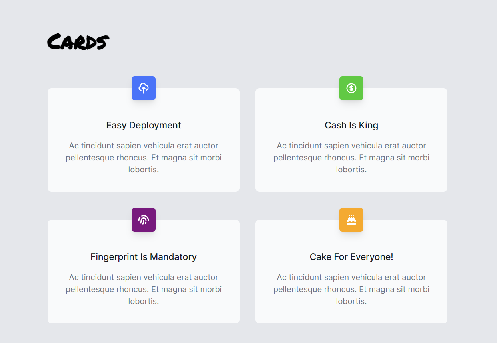

# Component Library - An exercise in building reusable components

## Description
This project contains a number of React Components shown on separate pages.

The button menu at the top left is used to select Component Type: Badge, Banner, Card or Testimonial.

The support for responsive design can be seen if the size of the browser's size. 

The Menu button is also implemented as a reusable React Component.

## Technologies
- HTML
- CSS
- JavaScript
- React

## Live link
Quizzical is deployed here:
[https://serenander-component-library.netlify.app/](https://serenander-component-library.netlify.app/))

Please feel free to click around and explore!
